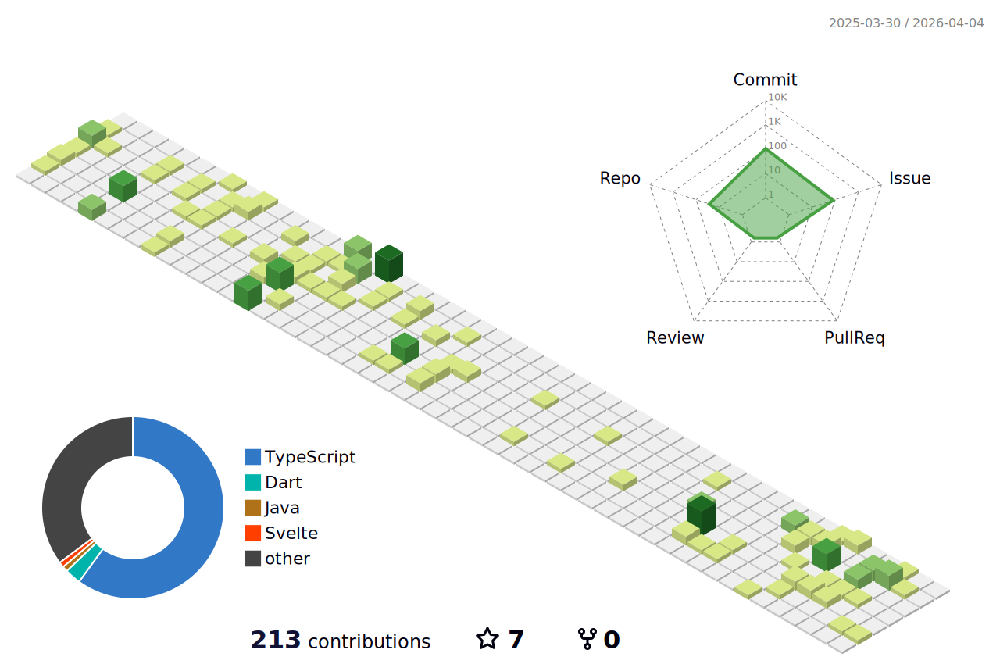

<!-- 헤더 배너 -->

    

  <!-- 방문자 카운터 -->
  
  

---

## 🧰 Tech Stack

---

### 🧑‍💻 Frontend & Development

### 🛠️ Tools & Platform

---

## 🚀 Featured Projects

<table>
  <thead align="center">
    <tr>
      <td><b>🎁 Projects</b></td>
      <td><b>👥 Team</b></td>
      <td><b>📝 Description</b></td>
    </tr>
  </thead>
  <tbody>
    <tr>
      <td><a href="https://github.com/TEAM-ROMROM/RomRom-BE"><b>롬롬 (ROMROM)</b></a></td>
      <td>Team of 7</td>
      <td>AI 기반 차세대 가치 교환 플랫폼 (물건·재능·시간 거래)</td>
    </tr>
    <tr>
      <td><a href="https://github.com/wheemin1/ottfriends"><b>OTT Friends</b></a></td>
      <td>Solo</td>
      <td>OTT 구독 공유 매칭 서비스</td>
    </tr>
    <tr>
      <td><a href="https://github.com/wheemin1/MobileSiteCheck"><b>MoCheck</b></a></td>
      <td>Solo</td>
      <td>PM·비개발자를 위한 웹 성능 분석 도구</td>
    </tr>
    <tr>
      <td><a href="https://github.com/wheemin1/securegps"><b>SecureNote</b></a></td>
      <td>Solo</td>
      <td>이미지 GPS 메타데이터 일괄 제거 웹앱</td>
    </tr>
    <tr>
      <td><a href="https://github.com/wheemin1/globaltime"><b>TimeSync</b></a></td>
      <td>Solo</td>
      <td>글로벌 팀을 위한 시차 변환 미팅 조율기</td>
    </tr>
  </tbody>
</table>

---

## 🎮 AI Game Platform

<table>
  <thead align="center">
    <tr>
      <td><b>🎁 Project</b></td>
      <td><b>👥 Team</b></td>
      <td><b>📝 Description</b></td>
      <td><b>🚀 Status</b></td>
    </tr>
  </thead>
  <tbody>
    <tr>
      <td><a href="https://github.com/wheemin1/codebattle"><b>코드 배틀 (Codebattle)</b></a></td>
      <td>Solo</td>
      <td>AI 기반 실시간 코드 배틀 게임 플랫폼 (출시 3일만에 150명 가입)</td>
      <td></td>
    </tr>
  </tbody>
</table>

---

## 🛠️ Utility Tools

<table>
  <thead align="center">
    <tr>
      <td><b>🎁 Projects</b></td>
      <td><b>⭐ Stars</b></td>
      <td><b>📚 Description</b></td>
    </tr>
  </thead>
  <tbody>
    <tr>
      <td><a href="https://github.com/wheemin1/shortcuts"><b>Shortcuts</b></a></td>
      <td></td>
      <td>단축키 모음 도구</td>
    </tr>
    <tr>
      <td><a href="https://github.com/wheemin1/RuneConverter"><b>Rune Converter</b></a></td>
      <td></td>
      <td>룬 문자 변환기</td>
    </tr>
    <tr>
      <td><a href="https://github.com/wheemin1/globaltime"><b>Global Time</b></a></td>
      <td></td>
      <td>전 세계 시간대 확인 도구</td>
    </tr>
    <tr>
      <td><a href="https://github.com/wheemin1/MobileSiteCheck"><b>Mobile Site Check</b></a></td>
      <td></td>
      <td>모바일 사이트 체크 도구</td>
    </tr>
    <tr>
      <td><a href="https://github.com/wheemin1/SEO-tool"><b>SEO Tool</b></a></td>
      <td></td>
      <td>SEO 분석 도구</td>
    </tr>
    <tr>
      <td><a href="https://github.com/wheemin1/Developer-Tools"><b>Developer Tools</b></a></td>
      <td></td>
      <td>개발자를 위한 유틸리티 모음</td>
    </tr>
  </tbody>
</table>

---

## 📊 GitHub Stats

|  |  |
|---------------------------------------------------------------------------------------------------------------------------------------------------------------------------------------|---------------------------------------------------------------------------------------------------------------------------------------------------|
|  |                               |

<!-- Contribution Graph -->

---

## 📫 Connect with me

  
  

> *참고: 공개 저장소 기준이며, 통계는 자동으로 업데이트됩니다.*

