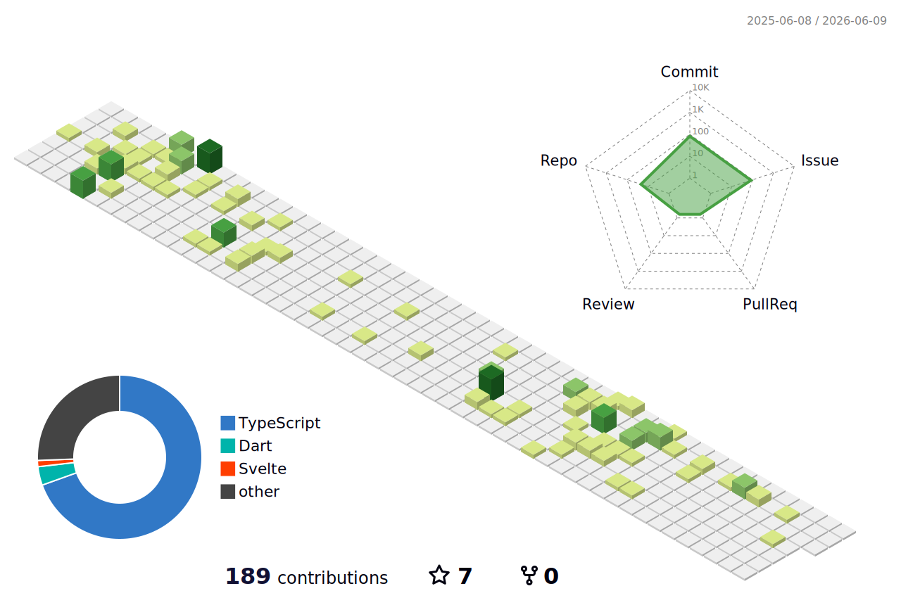

<!-- 헤더 배너 -->

    

  <!-- 방문자 카운터 -->
  
  

---
### 👋 About Me

**기획자지만, 상상이 현실이 될 때까지 기다리지 않습니다.**

* 🎯 **Main:** 비즈니스 모델 설계 & 서비스 기획 (PM/PO)
* 🛠️ **Skill:** React/Supabase를 활용한 **빠른 MVP 구현 능력**
* 💬 **Motto:** "이거 구현 되나요?"라고 묻는 대신, "**프로토타입 만들어 왔습니다**"라고 말합니다.

---
## 🧰 Tech Stack (AI-Native Builder)

> **"직접 코딩하기보다, AI 에이전트와 협업하여 비즈니스 가치를 가장 빠르게 '실제 서비스'로 구현합니다."**

### 🤖 AI-Driven Development (The Agents I Lead)

### 📊 Data & Growth Strategy (Analytics)

### 🏗️ Infrastructure & DB (Ship & Manage)

### 📈 Design & Product Management

---

## 🚀 Featured Projects

<table>
  <thead align="center">
    <tr>
      <td width="20%"><b>🎁 Project</b></td>
      <td width="25%"><b>👑 Role / Links</b></td>
      <td width="20%"><b>📊 Stats</b></td>
      <td width="35%"><b>📝 Description</b></td>
    </tr>
  </thead>
  <tbody>
    <tr>
      <td align="center"><b>롬롬 (ROMROM)</b></td>
      <td align="center">
        <b>PM & Planning Lead</b> 
         
        
        
      </td>
      <td align="center">Team of 7 <b>Live Now</b></td>
      <td>AI 기반 차세대 가치 교환 플랫폼 (물건·재능·시간 거래)</td>
    </tr>
    <tr>
      <td align="center"><b>모임티아이 (MoimTI)</b></td>
      <td align="center">
        <b>Solo Build</b> 
        
      </td>
      <td align="center"><b>266+ User</b></td>
      <td>그룹 MBTI 궁합 분석 서비스. <b>현재까지 서비스 사용자 286명</b></td>
    </tr>
    <tr>
      <td align="center"><b>룬 컨버터 (Rune Converter)</b></td>
      <td align="center">
        <b>Solo Build</b> 
        
      </td>
      <td align="center"><b>20k+ View</b> (SEO Success)</td>
      <td>룬 문자 번역 및 변환기. <b>누적 노출수 20,000회 이상 기록</b></td>
    </tr>
    <tr>
      <td align="center"><b>코드 배틀 (Codebattle)</b></td>
      <td align="center">
        <b>Solo Build</b> 
         
        
      </td>
      <td align="center"><b>330+ User</b> (in 7 Days)</td>
      <td>AI 기반 실시간 코드 배틀 게임 플랫폼 (출시 7일 만에 330명 가입 기록)</td>
    </tr>
  </tbody>
</table>

---

## 🛠️ Utility Tools (PM & Expert Tools)

<table>
  <thead align="center">
    <tr>
      <td width="25%"><b>🎁 Projects</b></td>
      <td width="25%"><b>🔗 Links</b></td>
      <td width="50%"><b>📚 Description</b></td>
    </tr>
  </thead>
  <tbody>
    <tr>
      <td align="center"><b>MoCheck</b></td>
      <td align="center">
        
        
      </td>
      <td>Google PageSpeed & Lighthouse 기반 <b>PM용 웹 성능/모바일 최적화 분석 도구</b></td>
    </tr>
    <tr>
      <td align="center"><b>SecureGPS</b></td>
      <td align="center">
        
        
      </td>
      <td>개인정보 보호를 위한 <b>100% 온디바이스 GPS 및 메타데이터 일괄 제거 툴</b></td>
    </tr>
    <tr>
      <td align="center"><b>TimeSync</b></td>
      <td align="center">
        
        
      </td>
      <td>글로벌 협업 팀을 위한 <b>시차 변환 및 미팅 예약 플래너</b></td>
    </tr>
  </tbody>
</table>

---

## 🧪 Experiments & Personal Lab

<table>
  <thead align="center">
    <tr>
      <td width="25%"><b>🎁 Projects</b></td>
      <td width="25%"><b>🔗 Links</b></td>
      <td width="50%"><b>📚 Description</b></td>
    </tr>
  </thead>
  <tbody>
    <tr>
      <td align="center"><b>MinMim (민밈)</b></td>
      <td align="center">
        
      </td>
      <td>건설환경공학과 전공 암기를 돕기 위한 <b>AI 기반 전공 퀴즈 플랫폼</b> (학우들 사이 인기 폭발)</td>
    </tr>
    <tr>
      <td align="center"><b>상형문자 번역기</b></td>
      <td align="center">
        
      </td>
      <td>AI 에이전트로 빌드한 <b>이집트 상형문자 번역 및 변환 실험기</b></td>
    </tr>
    <tr>
      <td align="center"><b>Lotto Simulator</b></td>
      <td align="center">
        
      </td>
      <td>확률 기반의 <b>로또 번호 생성 및 당첨 시뮬레이터</b></td>
    </tr>
    <tr>
      <td align="center"><b>Dev-Tools</b></td>
      <td align="center">
        
      </td>
      <td>생산성 향상을 위한 단축키 및 빌더용 잡다한 유틸리티 모음 저장소</td>
    </tr>
  </tbody>
</table>
---

## 📊 GitHub Stats

---

## 📫 Connect with me

  
  

> *참고: 공개 저장소 기준이며, 통계는 자동으로 업데이트됩니다.*

